

<!-- paginate: skip
_class: invert lead -->

# Fra ordnet.dk til ordnet.dk

Nicolai Hartvig Sørensen

Det Danske Sprog- og Litteraturselskabs årsmøde 2024

<!--
Jeg hedder Nicolai og jeg er blevet bedt om at fortælle lidt om arbejdet med at udvikle en ny version af ordnet.dk
-->

---

# Om mig

- Nicolai Hartvig Sørensen
- email: [nhs@dsl.dk](mailto:nhs@dsl.dk)
- ansat på DSL 2005-, udvikler på ordnet.dk 2005-

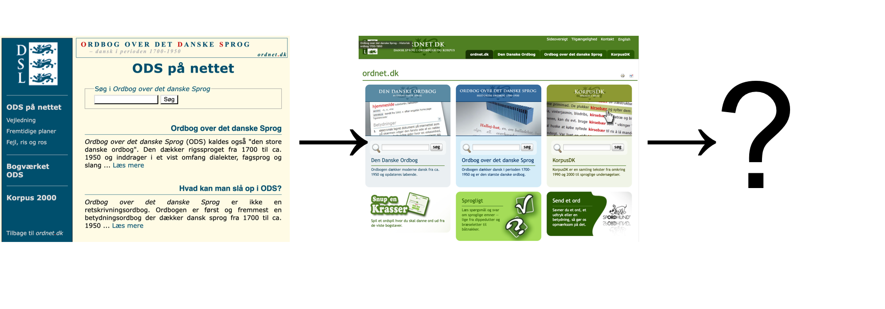

<!-- 
Jeg arbejdet på DSL siden 2005, og jeg har faktisk arbejdet med ordnet.dk lige fra starten, så jeg var også med til det oprindelige "ODS på nettet".
-->

---

# Om dette projekt
  
- særbevilling fra Kulturministeriet 2023
- Carlsbergfondets bevilling til DSL 2023-25

<!--
Arbejdet med et nyt ordnet.dk var egentlig allerede i gang, men med en særbevilling fra Kulturministeriet 2023 sammen med Carlsbergfondets bevilling blev det muligt at indhente ekstern konsulenthjælp så vi kunne få **nye øjne** på opgaven.
-->

---

# Hvorfor?

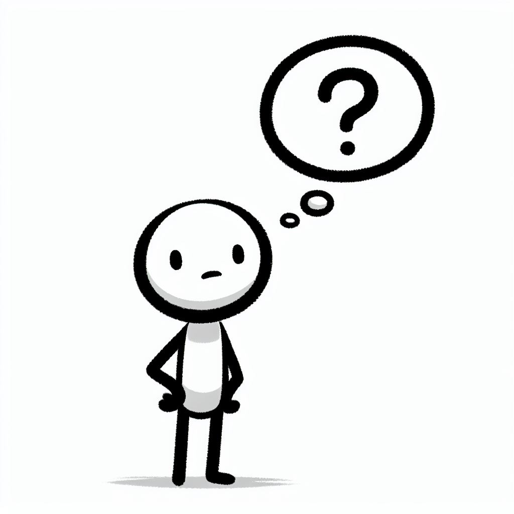

<!--
Men først er det måske nødvendigt at fortælle hvorfor det overhovedet har været nødvendigt at med en ny version af ordnet.dk. 

Selvom den har kørt stort set uændret siden 2009 og 15 år er meget i it-sammenhæng, har vi egentlig ikke været utilfreds med den. 
-->

---

# Derfor 1: Teknik

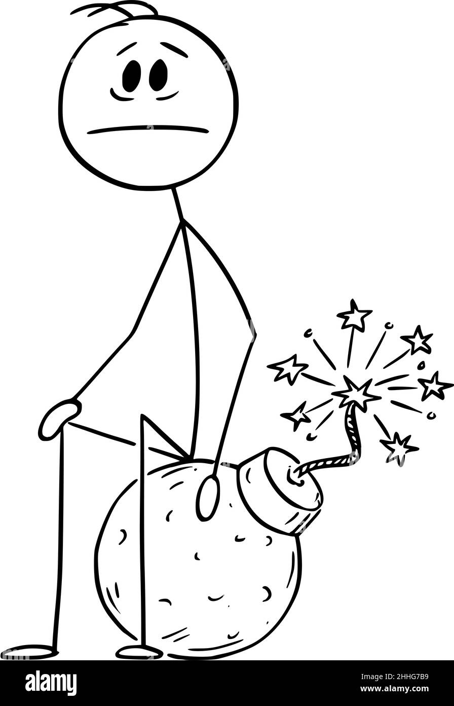

<!-- 
Den vigtigtste grund er simpelthen teknik. Hjemmesiden bliver drevet af gammel teknik som er svær at vedligeholde og som det er svært at finde konsulenter til

Den har også været meget svært at skalere op for at følge de flere og flere brugere gennem årene.

Det er simpelt hen en tikkende bombe - og på et tidspunkt inden alt for længe vil vi ikke kunne få sitet op igen efter et nedbrud.
-->

---

# Derfor 2: Vokseværk

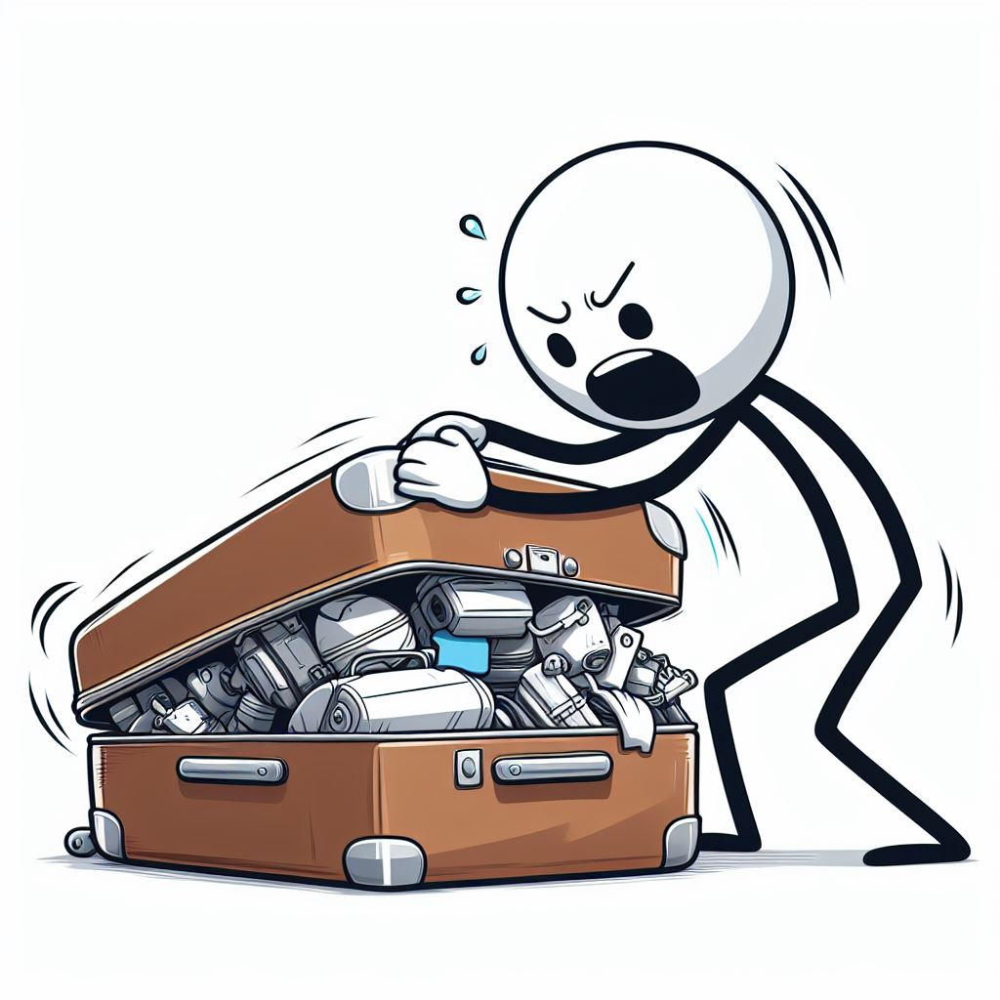

<!-- 
Den anden grund er vokseværk.

Oprindeligt var ordnet.dk designet til at vise kun to ordbøger, _Den Danske Ordbog_ og _Ordbog over det danske Sprog_. Men i mellemtiden er der kommet flere ordbøger til, så vi nu de sidste par år har hostet 12 online ordbøger.

DSL vil gerne samle alle ordbøger på samme site, ikke mindst for at bruge den store trafik til Den Danske Ordbog til at gøre opmærksom på de mere niche-prægede ordbøger.

Men:
-->

---

<!--
Det er der ikke plads til på det nuværende _ordnet.dk_ fordi navgiation mellem ordbøger foregår med et fanebladssystem.

Vi kan ikke få plads til alle 12 ordbøger så noget må i hvert fald ske.
-->

---

# Derfor 3: Brand-forvirring

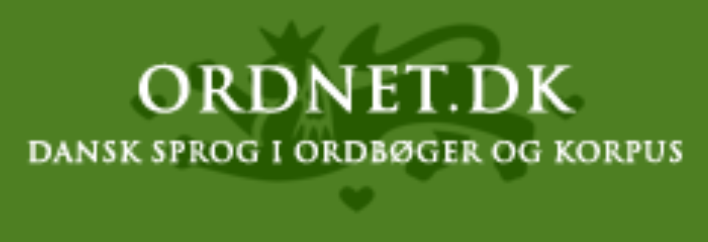

<!--
En tredje grund er brand-forvirring.

Vi har oplevet at mange brugere har haft svært ved afkode om de slår op i "ordnet.dk" eller i "Den Danske Ordbog", så der er et eller andet ved det nuværende site der forvirrer.

Det vigtigt at få håndteret denne forvirring, ikke mindst så Den Danske Ordbog kan stå stærkere i ansøgningssammenhæng. Fonde skal være sikre på hvad de faktisk støtter.
-->

---

# Derfor 4: Ændrede tider, ændrede brugere

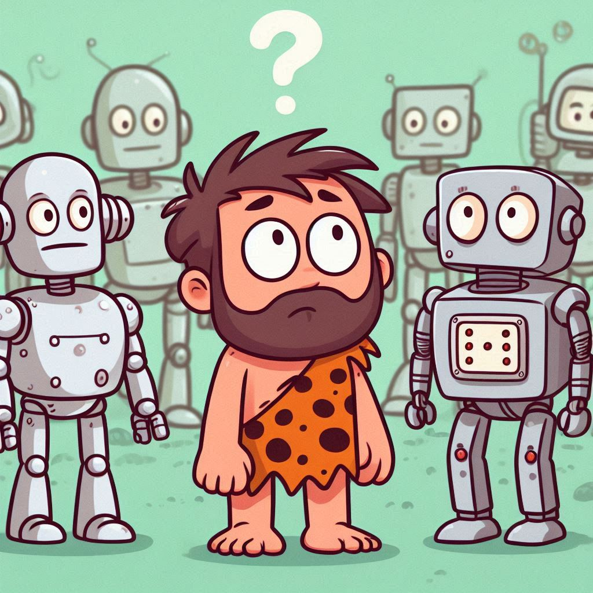

<!-- 
Der er også sket noget med brugerne på de 15 år, og hjemmesiden er ikke rigtigt fulgt med tiderne.
-->

---

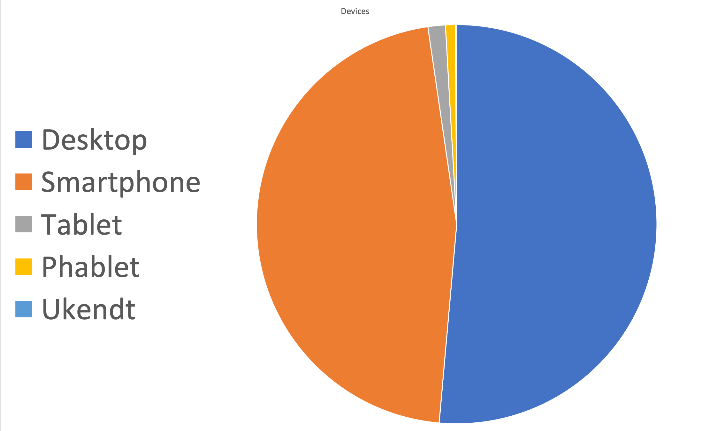

<!--
Fx viser vores statistik at næsten halvdelen af alle brugere tilgår ordnet.dk fra en smartphone - også selv der findes en dedikeret app til mange af ordbøgerne. 

Og også selvom brugerne blive mødt af dette syn på en smartphone:
-->

---

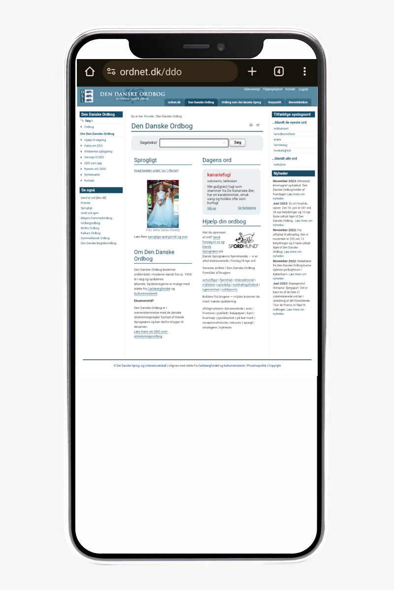

<!--
Vi kan godt afsløre at vi ikke havde IKKE forudset hvor populære smartphones ville blive, da vi arbejdet med designet i 2008 og 2009...
-->

---

# Derfor 5: For meget af det hele

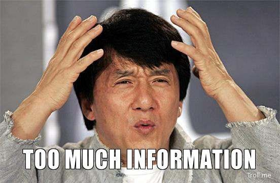

<!--
For det femte har vi for meget af det hele, og det er også noget konsulenterne har gentaget over for os i processen.

Vi har så mange oplysninger at bliver svært at få overblik over vores sider.

For selvom ordnet.dk startede ret rent og fint, så er indholdet efterhånden vokset uden at vi rigtigt har lagt en plan for det.
-->

---

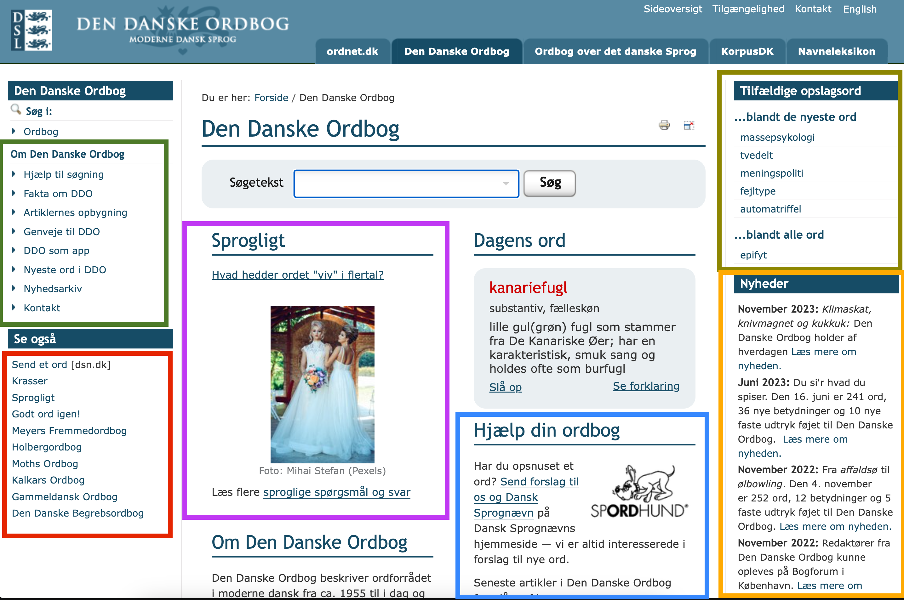

<!--
Her er for eksempel Den Danske Ordbogs forside.

Der sker rigtig meget og der er mange forskellige oplysninger der kæmper om opmærksomheden.

Vi har en lang menu-navigation i venstre spalte, vi har nogle ordlister i højre spalte, vi har lidt tilfældigt placerede oplysninger i midterspalten. Hvad er det vi gerne vil fortælle brugerne er det vigtige her?
-->

---

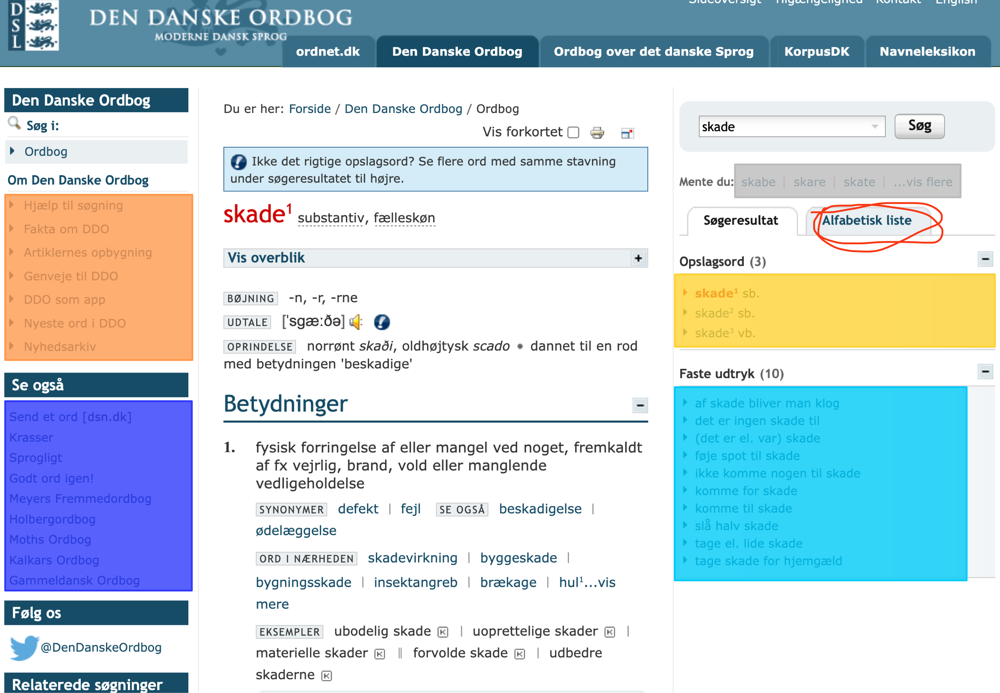

<!--
Det samme på en søgeresultatside. Der sker så meget at man faktisk vænner sig til kun at kigge i selve indholdsfeltet og ignorere alt uden om.
-->

---

# Dwarf

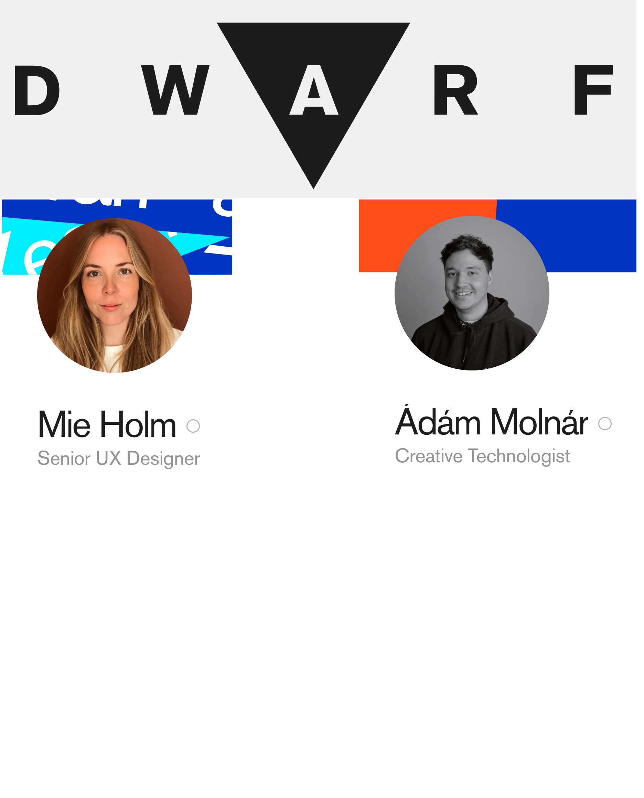

<!-- 
Da vi skulle vælge konsulenter, faldt valget på softwarehuset Dwarf. Vi kom især til at arbejde sammen med Mie og Adam og det var vi glade for.

Mie er brugergrænsefaldeekspert og benhård, og Adam er grafisk designer.
-->

---

# Overblik

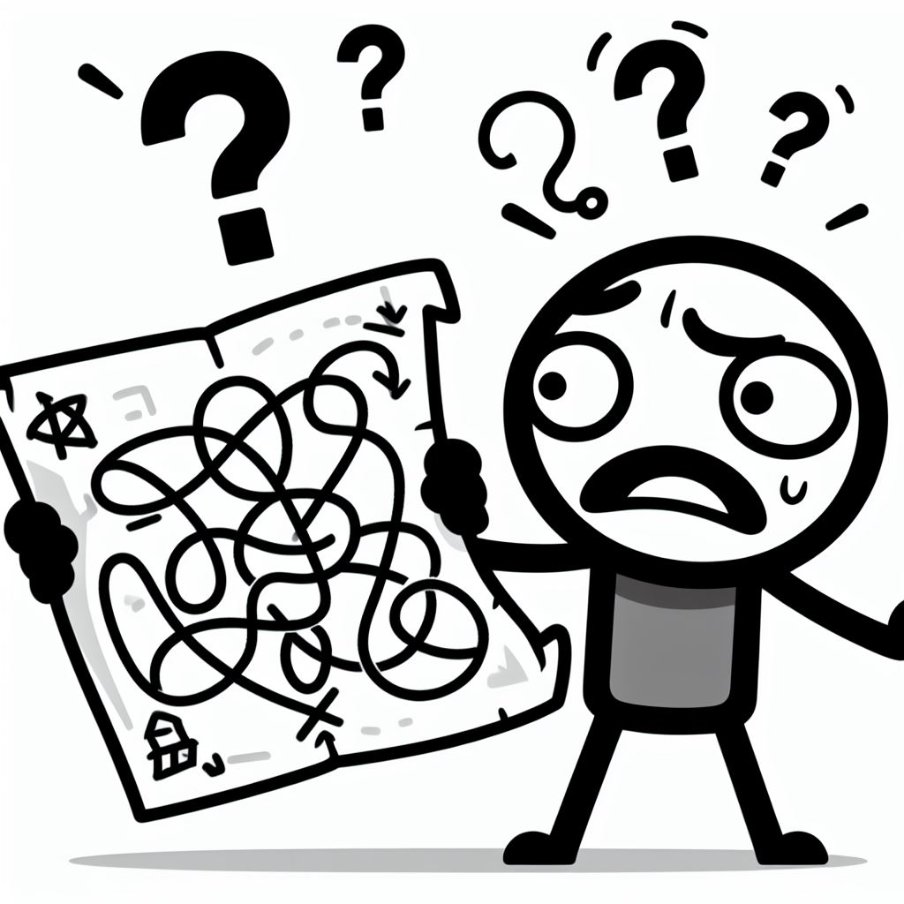

<!-- 
Den opgave der blev stillet til Dwarf, var at skabe det manglende overblik over ordnet.dk med 12 ordbøger - og skabe et nyt grafisk design -- uden ødelægge forbindelsen til det gamle ordnet.dk.

* Hvordan sikrer vi at brugerne ved hvilken ordbog de søger i?
* Hvordan gør vi det muligt for brugerne at finde en ordbog de er interesseret i, når ordbøgerne er så mange og dækker så forskellige perioder?

De kunne ikke helt holde sig til den opgave, men det vender jeg tilbage til.
-->

---

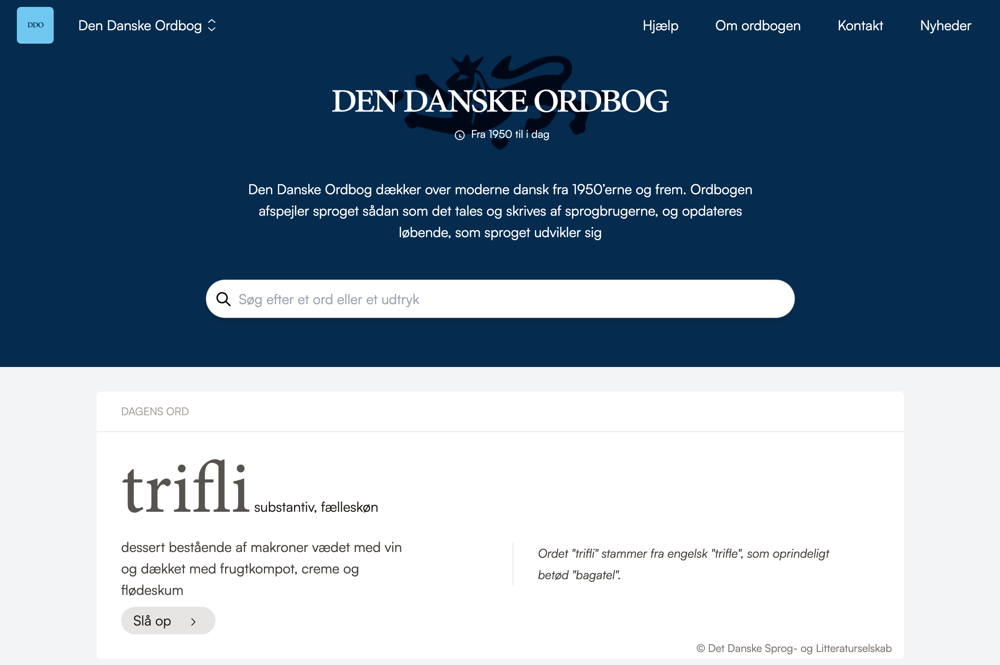

<!-- 
Her ser vi deres forslag til en ordbogs forside, i dette tilfælde Den Danske Ordbog, men det er tanken at alle ordbøger selvfølgelig er bygget op på den samme måde

Som vi kan se er antallet af centrale oplysninger reduceret til et søgefelt og for DDO, Dagens Ord

Det er det vigtige vi ønsker at brugerne skal se her.
-->

---

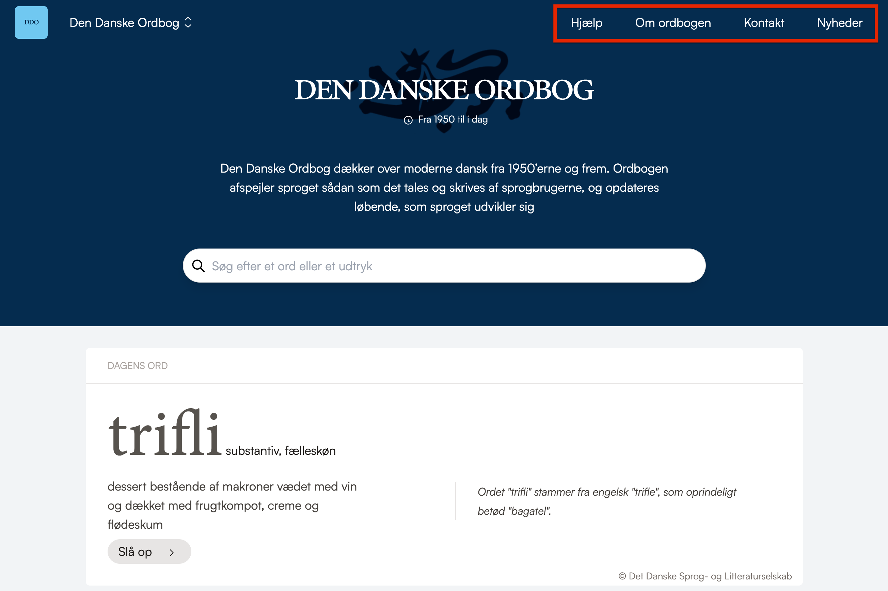

<!--
Hele venstre menu er nu flyttet til toppen og alle ordbøger får helt ensartede muligheder: Hjæp, Om ordbogen, Kontakt og eventuelt nyhder.
-->

---

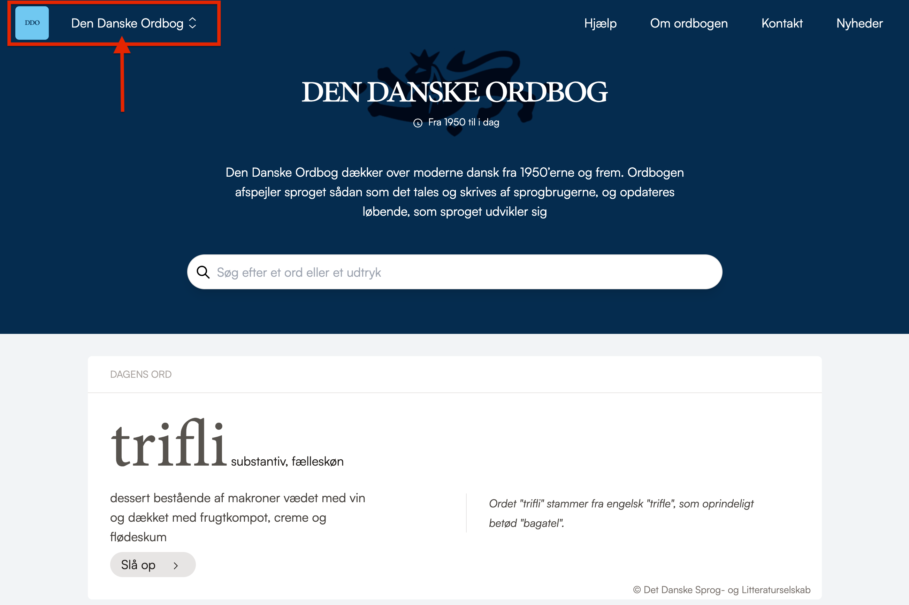

<!-- 

Vi kan også se at al omtale af ordnet.dk er forsvundet. Der er lagt vægt på at hver ordbog ligner et selvstændigt værk, så det er kun ordbogens navn og logo der fremgår.

Det er for at fortælle brugeren hvad de søger i lige nu og for at undgå sammenblandingen af fx Den Danske Ordbog og ordnet.dk.

For at navigere til en anden ordbog, åbner man et nagivationspanel ved at klikke på ordbogens navn med et traditionelt åbne-ikon
-->

---

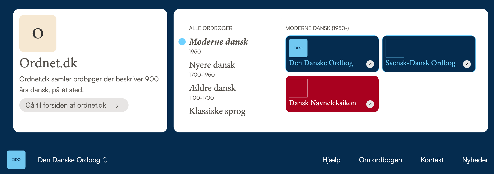

<!-- 
Det ser vi her.
-->

---

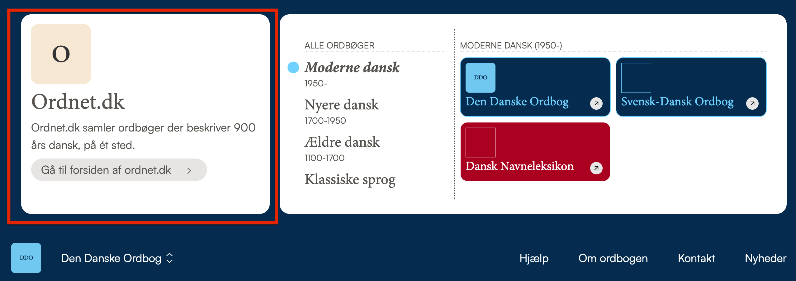

<!-- 
Det er først her navnet ordnet.dk fremgår, og man får straks en forklaring på hvad det er for et site.
-->

---

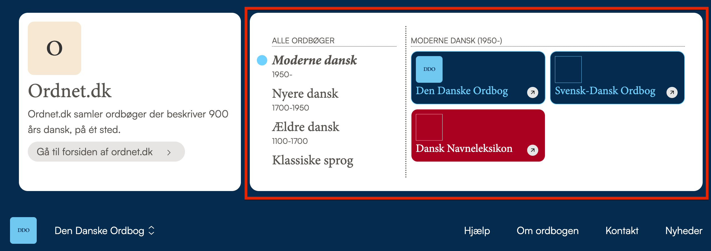

<!-- 
Til højre får man en liste over alle 12 ordbøger på ordnet.dk

De er inddelt i perioder så det er lettere at finde en ordbog man er interesseret i:

* Moderne dansk
* Nyere dansk
* Ældre dansk
* Klassiske sprog

-->

---

# Overblik: Farver

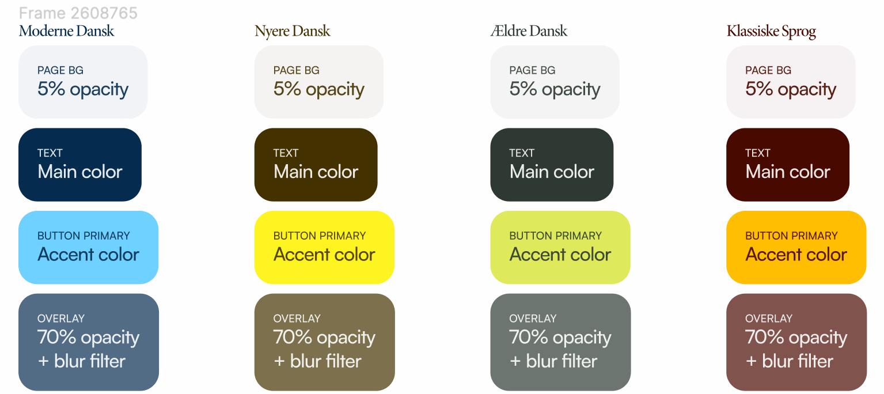

<!-- 
Hver periode har sit farvetema. Der er for mange ordbøger til at hver ordbog kan få sit eget farvetema, men på denne måde, kan brugerne forhåbentlig nemmere opdage når de skifte til en ny periode.
-->

---

# 2 Søgning

<!-- Det var egentlig den opgave Dwarf havde fået, og vi synes at de løste den opgave godt.

Men det var umuligt at stoppe dem i også
at kigge på søgeresultatet, selvom vi flere gange huskede dem på at de måtte ikke ændre søgeresultatet ...

Jeg havde måske håbet på en lidt pænere stil til den søgenavigation som jeg i mellemtiden havde udviklet, men ikke mere end det.

Den gik ikke med Mie.
-->

---

DISCLAIMER:

> »Jeg hadede Dwarfs forslag til søgning første gang jeg så den« – _Fiktivt citat, Nicolai Hartvig Sørensen_ (2024)

<!--
Og jeg må indrømme at da Mie først fremlagde sine tanker om søgning, så var jeg faktisk skuffet - og jeg tænkte at hun slet ikke havde forstået opslag i ordbøger.

Men desværre var hun meget overbevisende ...
-->

<!--
Dwarf ønskede to ting:

1. Gøre det nemmere at vælge det rigtige ord
2. Et roligere søgeresultat

For at gøre det nemt at vælge det rigtige ord, vil Dwarf gerne væk fra de simple ordlister hvor man kun ser ordet og eventuelt en ordklasse, men ikke mere end det.

Et eksempel er autofuldførelseslisten - altså den ordliste der kommer frem når man skriver i søgefeltet
-->

---

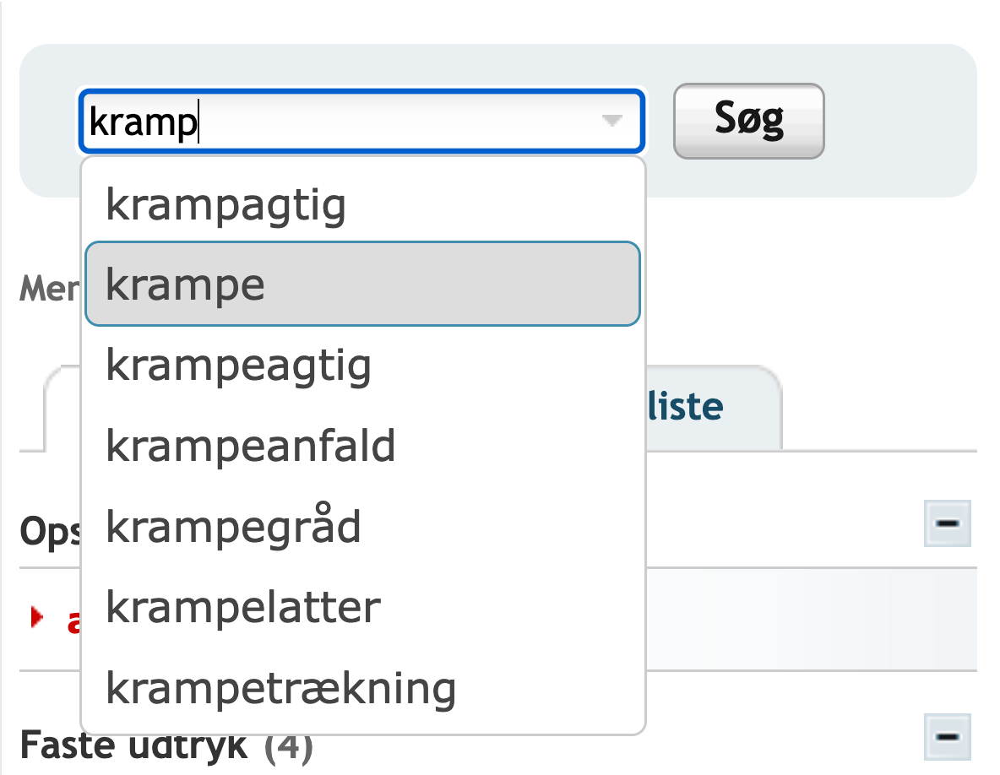

<!--
Dette er den nuværende autofuldførelse: Det er bare en liste af ord, og brugeren får ikke nogen hjælp til at vælge mellem ordene
-->

---

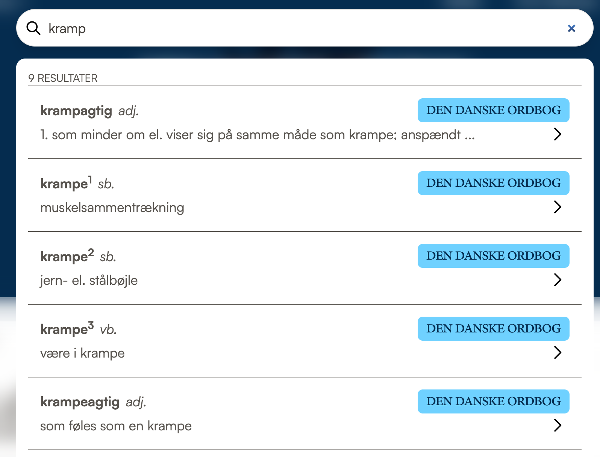

<!--
Dette er Dwarfs forslag. Her er der både kommet ordklasse og en kort glosse der skal gøre det muligt at brugeren at identificere et ord.

Samtidig fremgår det hvilken ordbog der er tale om, Den Danske Ordbog med farven der viser at det er ordbog der beskriver moderne dansk.

Dette er altid inkluderet fordi den samme type liste både bruges til søgning i en enkelt ordbog på tværs af ordbøger.
-->

---

# Søgeresultat

<!-- 
For søgeresultatet har det været vigtig for Dwarf både at gøre det så roligt så muligt, så brugeren

Men det har også været et princip at lokke brugerne til at gå på opdagelse i andre ordbøger.
-->

---

<!-- 
Her er så et eksempel på et opslag.

Fokus er nu udelukkende på det ord der er slået op.

Forhåbentlig har autofuldførelsen sørget for at det faktisk er det rigtige opslag, men der er stadig mulighed for at vælge en anden homograf med knapperne over opslagsordet. -->

---

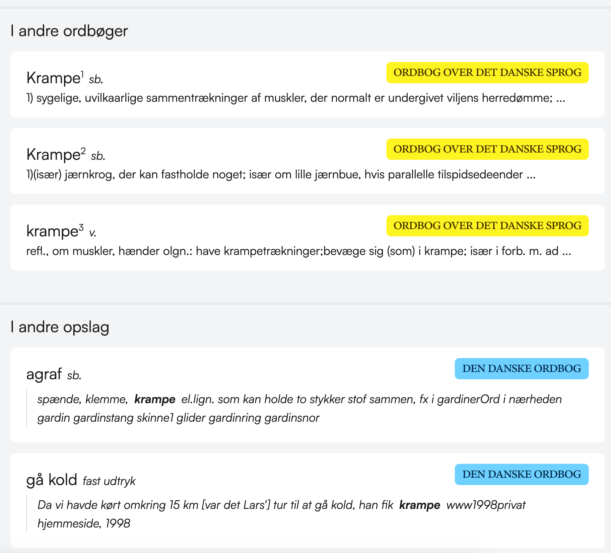

<!-- ... og under selve opslaget er der links til den samme søgning i andre bøger og i andre opslag i samme ordbog.

Modsat før er der nu plads til at vise glosser fra de andre opslag, så brugeren med det samme kan se om det er et relevant link.

Dette gælder også fritekstsøgning i andre opslag:
-->

---

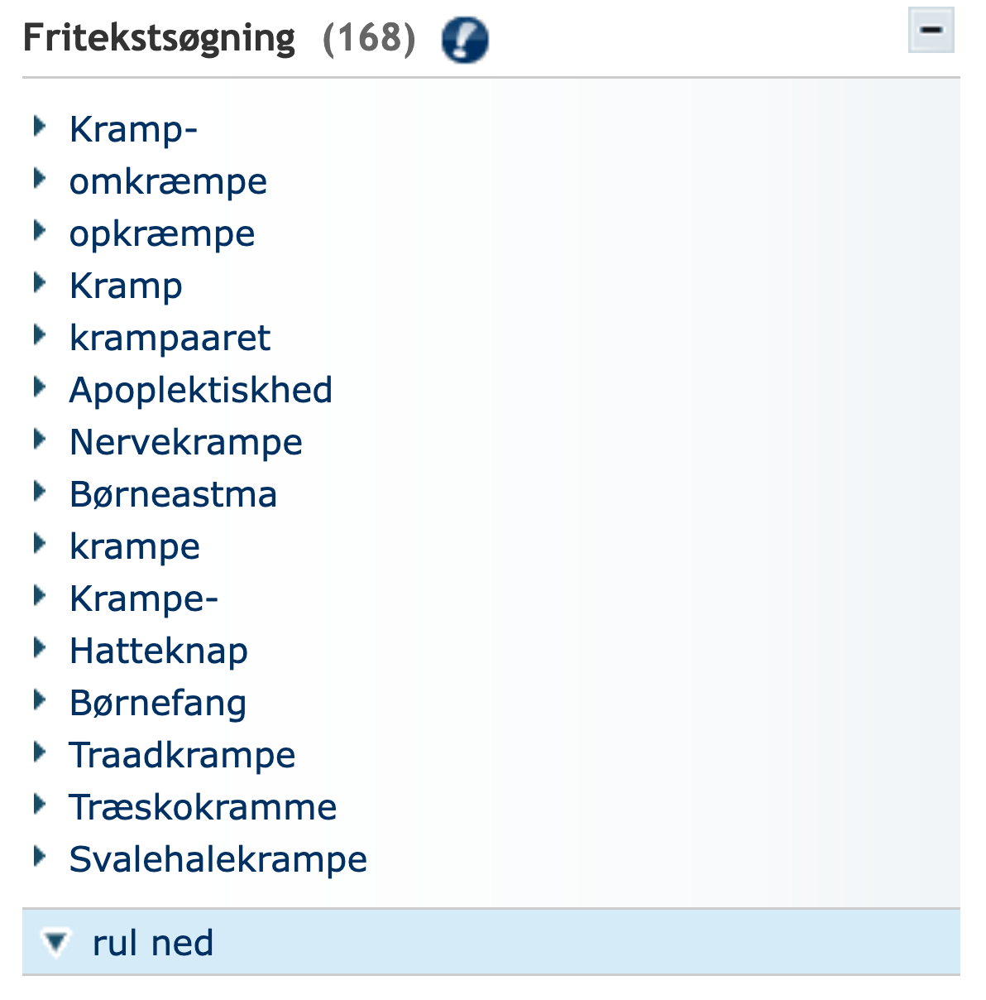

<!-- I den gamle version må brugeren klikke sig ind på hver enkelt opslag for at se om det er relevant
se fx dette eksempel på en fritekst søgning i ODS nu: -->

---

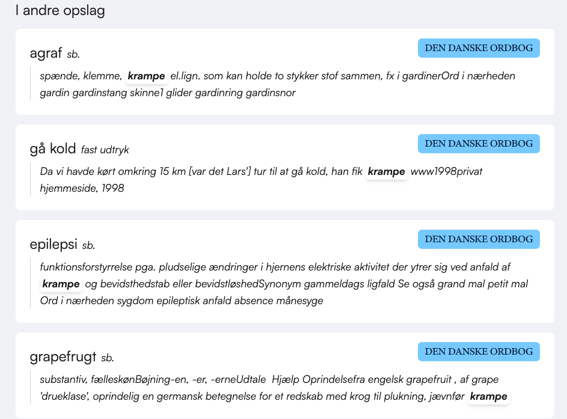
<!--
Mens nu vil der være plads til at se om matchet er relevant
-->

---

 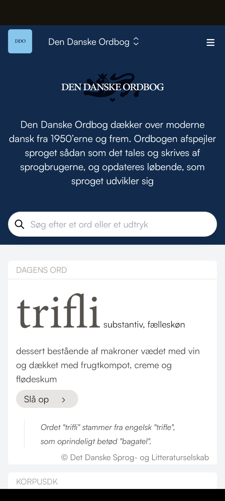
 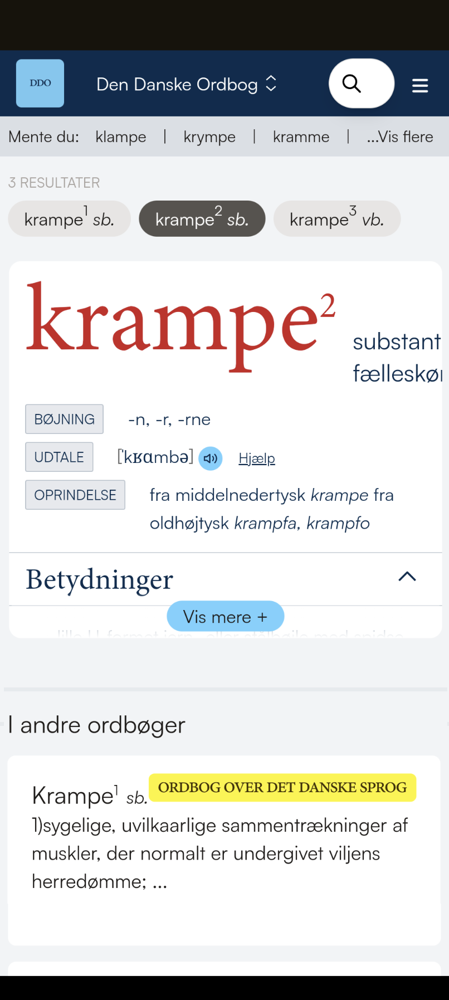

<!--
Og det hele kan selvfølgelig også vises på mobiltelefoner med samme funktionalitet som på en desktopcomputer.

Det er vigtigt fordi vi forventer at så mange brugere både bruger desktop og telefon.
-->

---

<!-- Men prisen for denne luksus er denne: -->

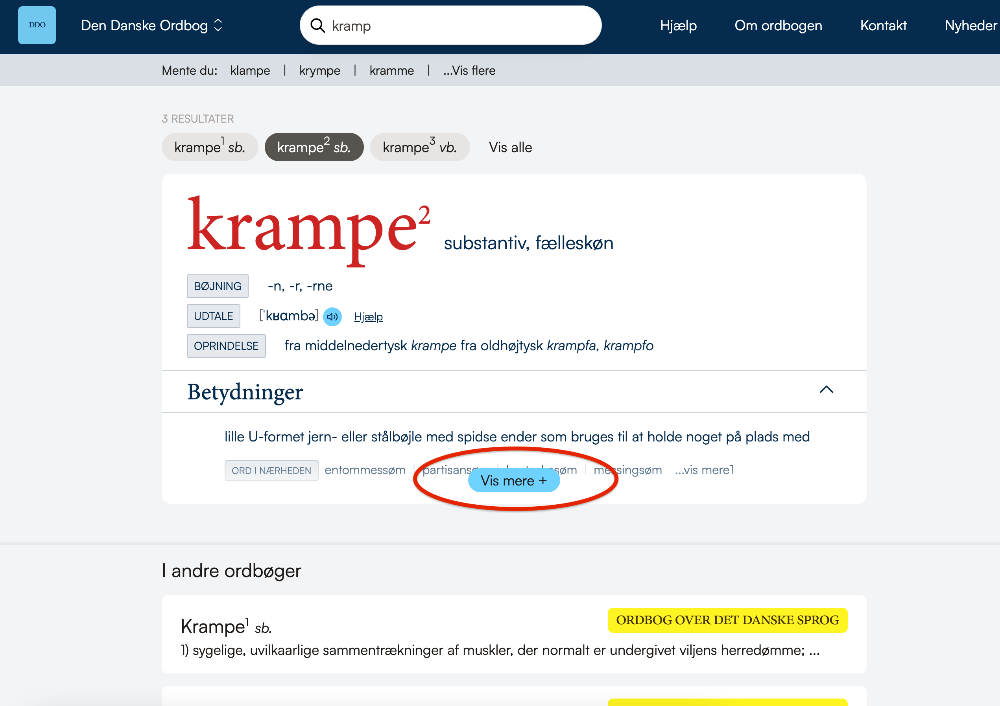

<!-- For at brugeren ikke drukner i lange opslag uden at opdage de andre muligheder der nu findes under opslaget, har Dwarf foreslået at vise en Vis mere-knap. Dette har allerede skabt debat i redaktionerne  -- Og også internt i mig. 

Jeg stejlede over Vis mere-knappen, indtil jeg blev overbevist om at de fyldigere links til andre ordbøger under opslaget, er netop hvad formålet med det nye ordnet.dk er:

At give brugerne en reel mulighed for at opdage de andre ordbogsressourcer som tidligere har været skjult på andre sites og i anonyme og uinspirerende ordblister. 
-->

---

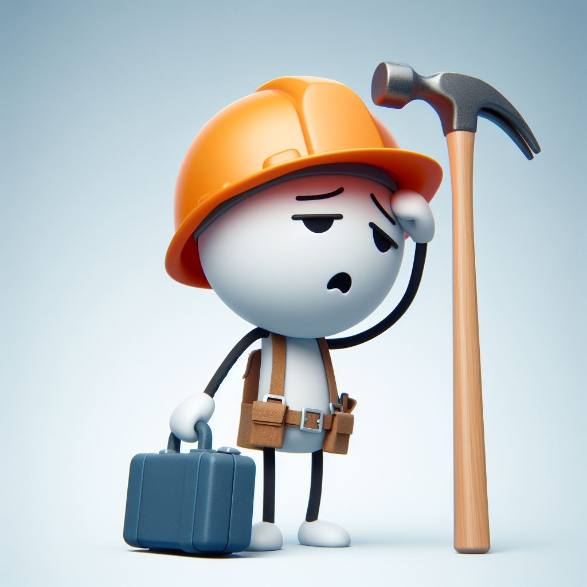

<!-- Det endte med et meget større projekt end vi forventede fordi Dwarf havde så drastiske forslag til ændringer i søgeresultatet. Vi er kommet langt med implementeringen og de fleste funktioner er klar, men der er mange detaljer der skal finpudses før vi kan gå i luften.

* Ikke mindst glosser som nu er centrale for meget af navigationen, fx i autofuldførelseslister, skal automatisk genereres ud fra indholdet hvilket ikke er ligetil i de historiske ordbøger

Men vi mener at resultatet kommer til at løse mange af eller alle de problemer vi havde håbet.
-->