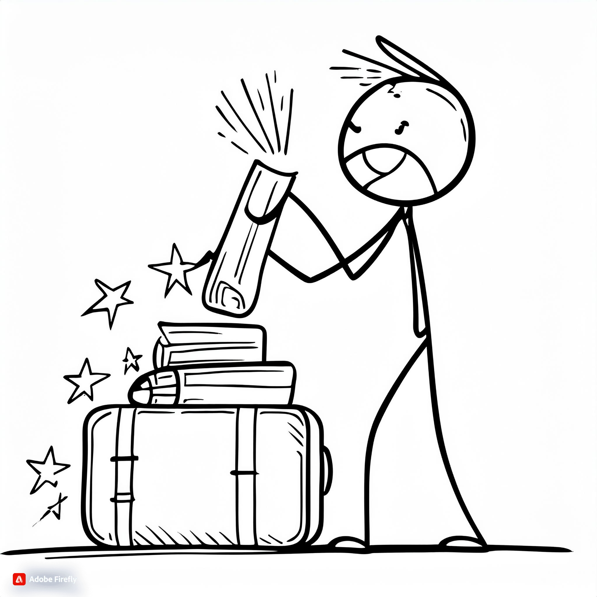

<!-- paginate: skip
_class: invert lead -->

# Fra ordnet.dk til ordnet.dk

## Nicolai Hartvig Sørensen

### Det Danske Sprog- og Litteraturselskabs årsmøde 2024

---

# Om mig

* Nicolai Harvig Sørensen
* email: [nhs@dsl.dk](mailto:nhs@dsl.dk)
* ansat på DSL siden 2005, på ordnet.dk siden 2005-

---

# Om dette projekt
  
* særbevilling fra Kulturministeriet 2023
* Carlsbergfondets grundbevilling til DSL 2023-25

---

# Derfor 1: Teknik

---

# Derfor 2: Vokseværk

---

---

# Derfor 3: Forvirring

---

# Derfor 4: Ændrede tider, ændrede brugere

---

---

---

# Derfor 5: For meget af det hele

---

---

---

# Derfor 6: Designproblem

---

---

# Dwarf

---

# Overblik

* Hver ordbog sit site
* "Ordnet.dk" skjult
* Åbning opad
* Inddeling i perioder

---

---

---

---

---

---

---

# Overblik: Farver

---

# 2 Søgning

<!-- Det var egentlig den opgave Dwarf havde fået. Men det var umuligt at stoppe dem i også
at kigge på søgeresultatet.

Jeg havde håbet på en lidt pænere stil til den søgenavigation som jeg i mellemtiden havde udviklet, men ikke andet.

Den gik ikke med Mie.
-->

---

DISCLAIMER:

> »Jeg hadede Dwarfs forslag til søgning første gang jeg så den« – _Fiktivt citat, Nicolai Hartvig Sørensen_ (2024)

---

<!-- Grundidéen er at gøre selve søgeresulatet så roligt som muligt og samtidig at gøre det nemmere at komme videre til næste relevante opslag 

Og samtidig at sikre at man
-->
