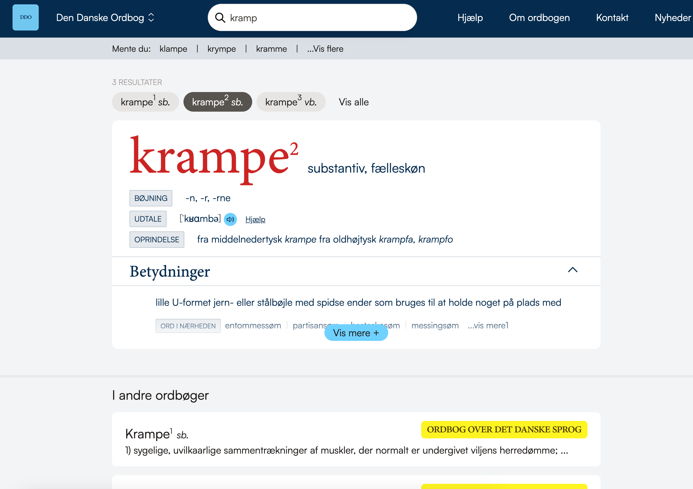

<!-- paginate: skip
_class: invert lead -->

# Fra ordnet.dk til ordnet.dk

## Nicolai Hartvig Sørensen

### Det Danske Sprog- og Litteraturselskabs årsmøde 2024

---

# Om mig

* Nicolai Harvig Sørensen
* email: [nhs@dsl.dk](mailto:nhs@dsl.dk)
* ansat på DSL siden 2005, udvikler på ordnet.dk 2005-

<!-- Jeg skal tale om et projekt om en helt ny version af ordnet.dk som vi arbejder på i øjeblikket -->

---

# Om dette projekt
  
* særbevilling fra Kulturministeriet 2023
* Carlsbergfondets bevilling til DSL 2023-25

<!-- Arbejdet med et nyt ordnet.dk var egentlig allerede i gang, men med en særbevilling fra Kulturministeriet 2023 sammen med Carlsbergfondets bevilling blev det muligt at indhente ekstern konsulenthjælp -->

---

# Hvorfor?

<!-- Først er det måske nødvendigt at fortælle hvorfor det har været nødvendigt at med en ny version af ordnet.dk. Selvom den har kørt stort set uændret siden 2009 har vi faktisk ikke rigtigt fået klager over at den ikke er tidssvarende, så hvorfor kaste sig over dette arbejde? -->

---

# Derfor 1: Teknik

<!-- 
Den vigtigtste grund er simpelthen teknik. Hjemmesiden bliver drevet af gammel teknik som er svær at vedligeholde og som det er svært at finde konsulenter til 
-->

---

# Derfor 2: Vokseværk

<!-- 
Oprindeligt var ordnet.dk designet til at vise to ordbøger, Den Danske Ordbog og Ordbog over det danske Sprog. Men 
-->

---

---

# Derfor 3: Brand-forvirring

---

# Derfor 4: Ændrede tider, ændrede brugere

<!-- 
Der er sket meget på 15 år, ikke kun med teknikken men også med den måde brugerne tilgår vores hjemmeside.
-->

<!-- 
-->
---

<!-- Næsten halvdelen af alle brugere tilgår ordnet.dk fra en smartphone - også selv der findes en dedikeret app til Den Danske Ordbog 

Og det er selvom brugerne blive mødt af denne hjemmesiden på en smartphone:
-->

---

---

# Derfor 5: For meget af det hele

---

---

---

---
<!-- 
# Derfor 6: Designproblem

---

---
-->

# Dwarf

---

# Overblik

* Hver ordbog sit site
* "Ordnet.dk" skjult
* Åbning opad
* Inddeling i perioder

---

---

---

---

---

---

---

# Overblik: Farver

---

# 2 Søgning

<!-- Det var egentlig den opgave Dwarf havde fået. Men det var umuligt at stoppe dem i også
at kigge på søgeresultatet.

Jeg havde håbet på en lidt pænere stil til den søgenavigation som jeg i mellemtiden havde udviklet, men ikke andet.

Den gik ikke med Mie.
-->

---

DISCLAIMER:

> »Jeg hadede Dwarfs forslag til søgning første gang jeg så den« – _Fiktivt citat, Nicolai Hartvig Sørensen_ (2024)

---

<!-- Grundidéen er at gøre selve søgeresulatet så roligt som muligt og samtidig at gøre det nemmere at komme videre til næste relevante opslag 

Og samtidig at sikre at man er bedre hjulpet til at finde det ønskede opslagsord i første hug. Dette sker gennem end udvide autofuldførelsesliste der kommer frem søgning
-->

---

---

# Søgeresultat

---

<!-- Fokus er nu udelukkende på det ord der er slået op, men stadig mulighed for at vælge en anden homograf -->

---

<!-- ... og under selve opslaget er der links til den samme søgning i andre bøger og i andre opslag i samme ordbog.

Modsat før er der nu plads til at vise snaser fra matchet, så brugeren med det samme kan se om det er et relevant link. I den gamle version må brugeren klikke sig ind på hver enkelt opslag for at se om det er relevant
se fx dette eksempel på en fritekst søgning i ODS nu: -->

 ---

 

---

 
 

---

<!-- Prisen for denne luksus er denne: -->

<!-- Så brugeren ikke drukner i lange opslag uden at opdage de andre muligheder der nu findes under opslaget. Dette skal nok - og har allerede internt in DDO-redaktionen skabt debat -->

<!-- Og også internt i mig. Jeg protesterede over Vis mere-knappen, jeg protesterede over udelukkelsen af Alfabetisk liste og fjernelse af søgeresultatlisten til højre -->