<!-- paginate: skip -->
# Fra ordnet.dk til ordnet.dk

Nicolai Hartvig Sørensen

---
<!-- paginate: true -->

1. Hvorfor?

---

## Ønsker 1: Det åbenlyse

* Mere moderne underliggende teknisk platform
* Mere moderne visning der fx tager højde for moderne luner som mobiltelefoner
* Simplere hosting

---

## Ønsker 2. Samling af alle DSL's ordbogsressourcer på ordnet.dk

<!--

1. Promovering af nice-ordbøger.

- De lever en obskur tilværelse. Måske kan de bruges mere hvis flere DDO-brugere opdager dem? Uden at gå i vejen for DDO
- Giver større mening af henvise mellem ordbøger hvis de ligger på samme site (end at brugerne oplever at de pludselig beinfer sig på et helt andet domæne)
- De vil få SEO-boost
-->
---

## Samling af alle ordbøger: Problem

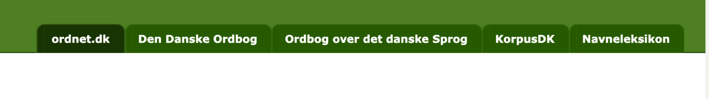

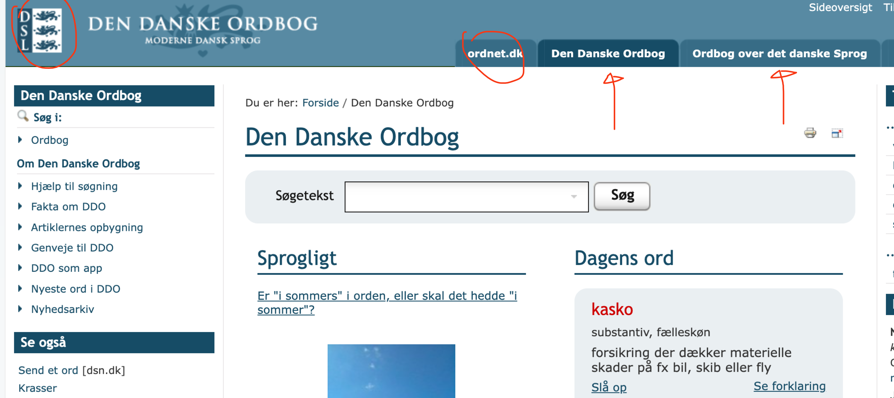

<!--
Men: I det oprindelige ordet.dk-projekt var der ikke tænkt på flere ordbøger end Den Danske Ordbog og Ordbog over det danske Sprog, men

Desuden ordnet.dk vs ordbøger vs DSL. Sikkert med til at vedligeholde problemet med at
-->

---

## Ønsker 3. Håndtering af søgning på homografer

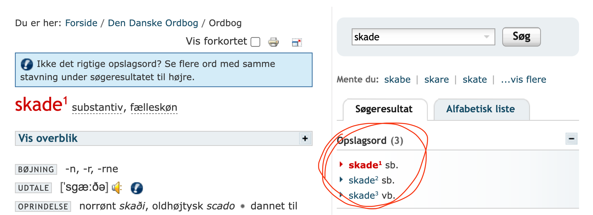

---

## 3. Forsimpling af søgeresultatside

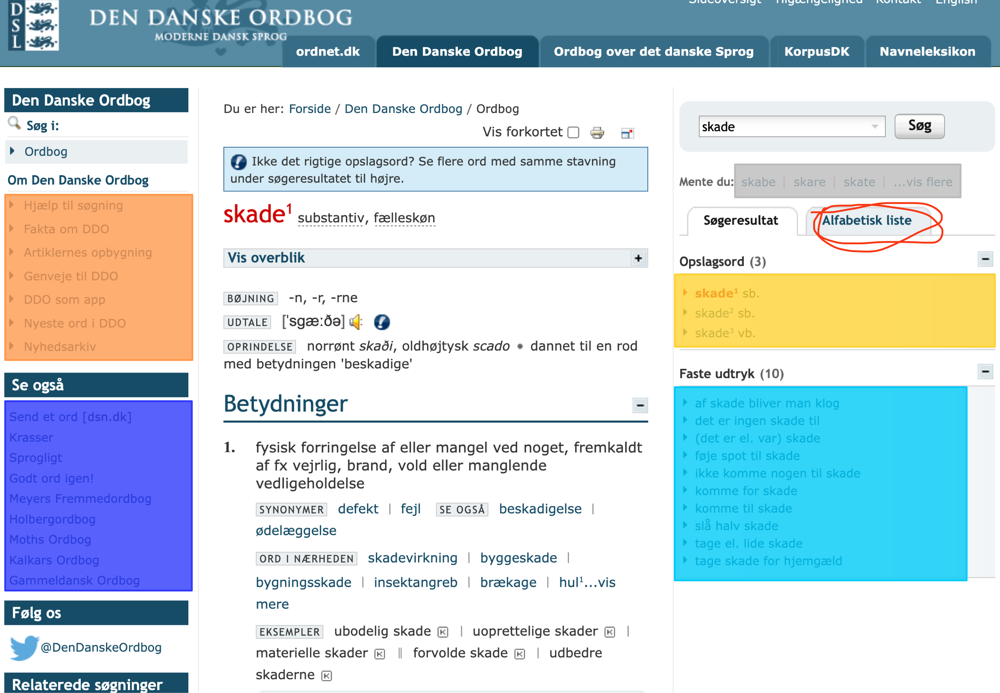

<!--
Der sker _mange_ ting på en ordbogs søgeresultatside

- Venstre spalte
- Søgeresultat
- ... Ud over selve ordbogens indhold der kan være teksttungt eller informationstungt.
-->

---

## Mellemspil: Mit forsøg

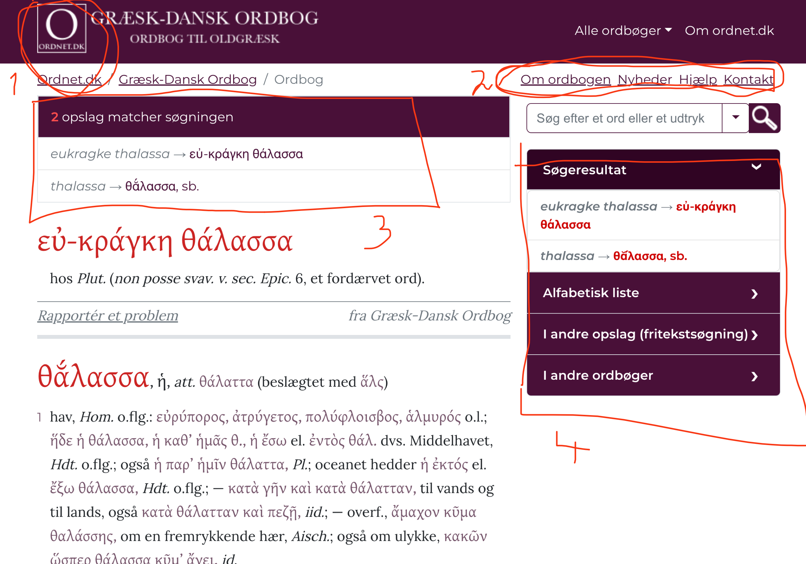

<!--

1. DSL er forsvundet, kun Ordnet.dk og aktuelle ordbog tilbage
2. Hele venstre spalte flyttet til maks. 4 links
3. Alle homografer vises nu samtidig med en klikbar indholdsfortegnelse i toppen
4. Al søgenavigation samlet i én ensartet boks

 -->

---

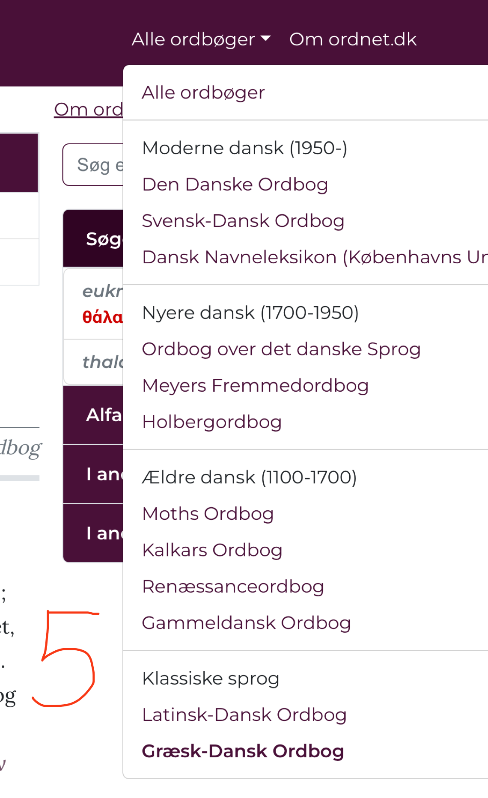

<!--

Fanebladene er blevet til en liste over alle ordbøger, opdelt i 4 tidsperioder

-->

---

## Dwarf

---

## Brugerens overblik: Farver

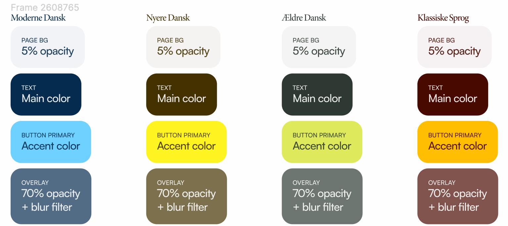

<!--

- Ét farveskema for hver tidsperiode
- + En række gennemsigtigere farver
- + En "kontrastfarve"

... Designeren ville meget gerne tweake DDO-blå for at få farver til at spille sammen

-->

---

## Brugerens overblik 1: Hvor er jeg? (demo-visning, ikke endelige)

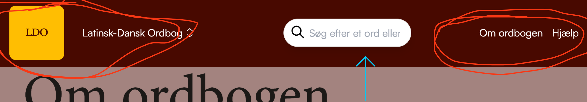

<!--
Ikke færdige visning! Kun for at vise elementer

1. Kun ordbogen vises
2. Ingen link til ordnet.dk-sider, ingen DSL, kun aktuelle ordbog
3. Søgefelt til aktuelle ordbog altid synlig
 -->

---

## Brugerens overblik 2: Navigation mellem ordbøger

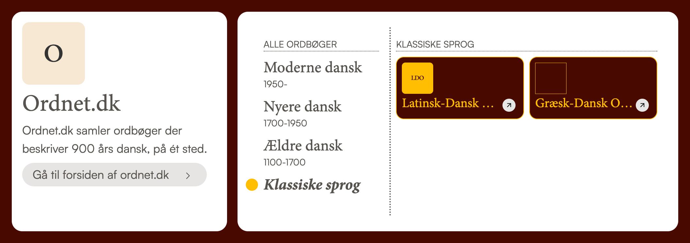

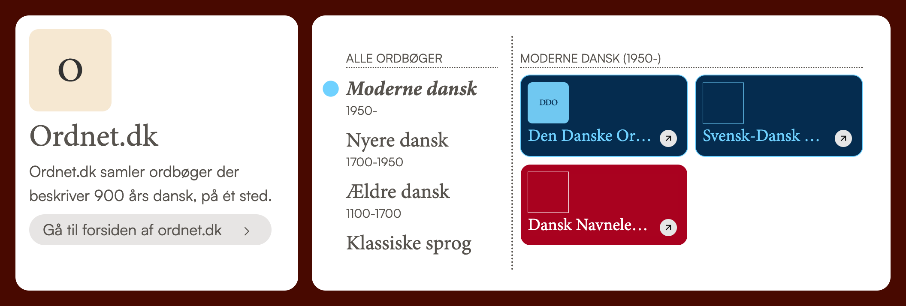

<!--

Her er sker navigation til ordnet.dk

-->

---

## Søgeresultat: Disclaimer

> "Jeg hadede denne tilgang til søgeresultatet første gang først gang jeg så den" -- _Nicolai Hartvig Sørensen_ (2023)

---

## Søgeresultat: Autofuldførelse FTW!

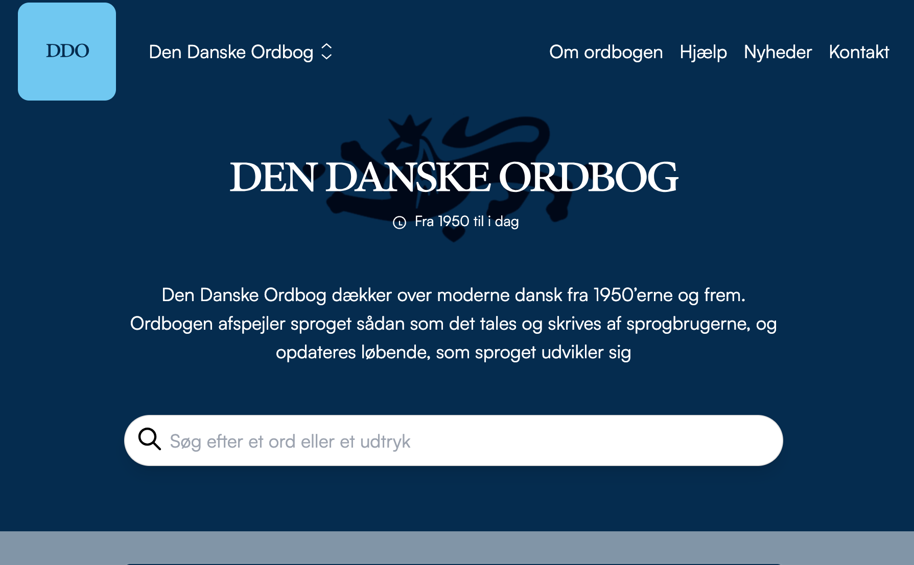

[Demo](http://localhost:1314/ddo/)

<!--
Autofuldførelse overtager arbejdet for søgeresultatet
 -->

---

## Søgeresultat: Autofuldførelse, problem

* Auto-glosser på alle ikke-homografer i DDO (og på alle andre ordbøger)

---

## Søgeresultat: Visning

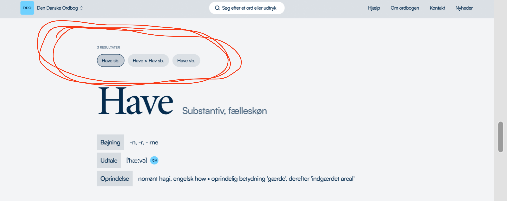

<!--
Vil forholde mig mere frit til disse forslag fra Dwarf: Rød opslagsord etc.

1. Homografer som piller - vil også indføre en "vis alle"-pille
2.

-->

---

## Søgeresultat: Vis mere

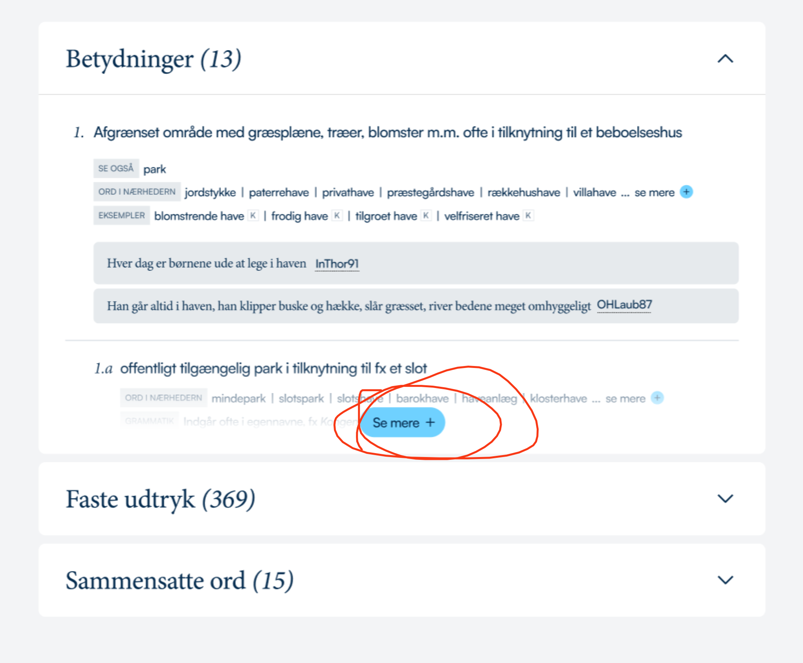

---

## Søgeresultat: The clever part

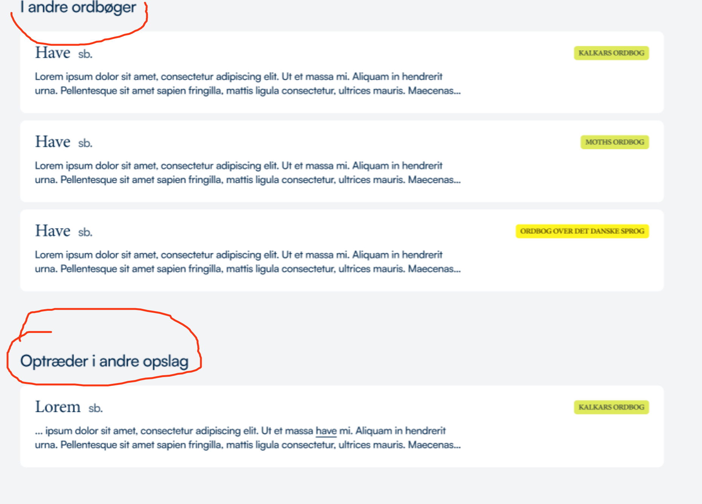

---

## Søgeresultat: Hvad der så kan fjernes

